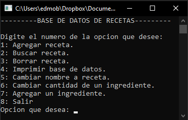

# Recipes
Console application that uses linked lists to manage a database that stores recipes.

## Operations
1. Add recipe.
2. Search recipe.
3. Delete recipe.
4. Print database.
5. Change recipe name.
6. Change ingredient quantity.
7. Add an ingredient.
8. Exit.

## GUI
